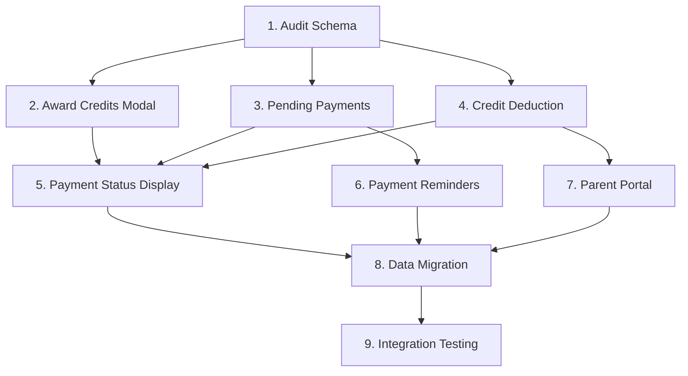

# Implementation Plan

## Overview

This implementation plan converts the Payment & Credits System Integration design into actionable coding tasks. Each task builds incrementally on previous work, focusing on connecting existing systems rather than building new ones. The plan prioritizes core functionality first, with optional testing tasks marked for flexibility.

## Task List

- [x] 1. Audit existing database schema and API endpoints
  - Verify current table structures and identify required modifications
  - Document existing API endpoints and their current functionality
  - Test existing credit transaction functions and payment workflows
  - _Requirements: 7.1, 7.2, 7.3, 7.4, 7.5_

- [x] 2. Enhance Award Credits Modal with student dropdown
  - [x] 2.1 Modify Award Credits modal to fetch enrolled students from API
    - Replace manual email input with searchable dropdown component
    - Integrate with existing `/api/teacher/students` endpoint
    - Add client-side validation for student selection
    - _Requirements: 1.1, 1.2, 1.3, 1.4_
  
  - [x] 2.2 Update credit award submission to use student_id
    - Modify form submission to send student_id instead of parent_email
    - Update API call to use student-based credit award endpoint
    - Add error handling for invalid student selections
    - _Requirements: 1.1, 1.2, 1.3_
  
  - [x] 2.3 Write unit tests for modal functionality
    - Test dropdown population with student data
    - Test form validation and submission logic
    - Test error handling scenarios
    - _Requirements: 1.1, 1.2, 1.3, 1.4_

- [x] 3. Implement pending payments calculation system
  - [x] 3.1 Create pending payments calculation endpoint
    - Implement SQL query to calculate unpaid class hours vs awarded credits
    - Create `/api/teacher/pending-payments` endpoint with proper authentication
    - Add rate-per-hour calculation from teacher profile data
    - _Requirements: 2.1, 2.2, 2.3, 2.4, 2.5_
  
  - [x] 3.2 Add pending payments display to teacher dashboard
    - Create UI component to display pending payments summary
    - Show total pending amount and breakdown by student
    - Add "Remind" and "Award Credits" action buttons
    - _Requirements: 2.1, 2.2, 2.3, 2.5_
  
  - [x] 3.3 Write integration tests for pending payments calculation
    - Test calculation accuracy with various class/credit scenarios
    - Test edge cases like zero balances and negative amounts
    - Test performance with large datasets
    - _Requirements: 2.1, 2.2, 2.3_

- [x] 4. Implement automatic credit deduction system
  - [x] 4.1 Add payment tracking fields to class_logs table
    - Add credits_deducted, is_paid, and payment_status columns
    - Create database migration script with proper defaults
    - Update TypeScript types to include new fields
    - _Requirements: 3.1, 3.2, 3.3, 3.6, 8.1, 8.2_
  
  - [x] 4.2 Implement credit deduction logic for class completion
    - Create function to calculate and deduct credits when class ends
    - Query student credit balance and determine deduction amount
    - Update class_logs with payment status and credits used
    - Create credit_transaction record for audit trail
    - _Requirements: 3.1, 3.2, 3.3, 3.4, 3.5, 3.6, 8.1, 8.2_
  
  - [x] 4.3 Integrate deduction logic with class logging workflow
    - Modify class completion API to trigger credit deduction
    - Add user feedback showing credit deduction results
    - Handle insufficient balance scenarios gracefully
    - _Requirements: 3.1, 3.2, 3.3, 3.6_
  
  - [x] 4.4 Write unit tests for credit deduction logic
    - Test full deduction scenarios with sufficient credits
    - Test partial deduction with insufficient credits
    - Test zero balance scenarios and error handling
    - Test concurrent deduction prevention
    - _Requirements: 3.1, 3.2, 3.3, 3.6, 8.1, 8.2_

- [x] 5. Add payment status display across interfaces
  - [x] 5.1 Create payment status badge component
    - Design visual badges for paid/partial/unpaid status
    - Implement status calculation logic based on class_logs data
    - Add consistent styling across all interfaces
    - _Requirements: 4.1, 4.2, 4.3, 4.4, 4.5_
  
  - [x] 5.2 Update class logs view with payment status
    - Add payment status column to class logs table
    - Show credits deducted and remaining balance information
    - Update existing ClassCard component with payment indicators
    - _Requirements: 4.1, 4.2, 4.3, 4.4, 4.5_
  
  - [x] 5.3 Update teacher dashboard with payment status overview
    - Add payment status summary to dashboard stats
    - Show recent payments table with credit impact
    - Display payment status in today's schedule view
    - _Requirements: 4.1, 4.2, 4.3, 4.4, 4.5_
  
  - [x] 5.4 Write UI tests for payment status display
    - Test badge rendering for all payment status types
    - Test status transitions and updates
    - Test responsive design across different screen sizes
    - _Requirements: 4.1, 4.2, 4.3, 4.4, 4.5_

- [ ] 6. Implement payment reminder system
  - [ ] 6.1 Create payment reminder email functionality
    - Design email template for payment reminders
    - Implement email sending using existing email service
    - Add reminder tracking to prevent spam
    - _Requirements: 5.1, 5.2, 5.3, 5.4, 5.5_
  
  - [ ] 6.2 Add reminder buttons to pending payments interface
    - Add "Send Reminder" button for each student with pending payments
    - Implement click handler to trigger email sending
    - Add confirmation feedback and error handling
    - _Requirements: 5.1, 5.2, 5.3, 5.4, 5.5_
  
  - [ ] 6.3 Write integration tests for reminder system
    - Test email template generation with student data
    - Test email delivery success and failure scenarios
    - Test reminder frequency limits and spam prevention
    - _Requirements: 5.1, 5.2, 5.3, 5.4, 5.5_

- [ ] 7. Create parent credit balance view
  - [ ] 7.1 Implement parent credit balance API endpoint
    - Create `/api/parent/child-credits` endpoint with proper authentication
    - Query child's credit account and transaction history
    - Calculate current balance, usage, and pending payments
    - _Requirements: 6.1, 6.2, 6.3, 6.4, 6.5_
  
  - [ ] 7.2 Create parent dashboard credit balance component
    - Design credit balance display with usage breakdown
    - Show recent class history with payment status
    - Add visual indicators for low balance warnings
    - _Requirements: 6.1, 6.2, 6.3, 6.4, 6.5_
  
  - [ ] 7.3 Implement data security for parent access
    - Ensure parents can only access their own children's data
    - Add proper authentication and authorization checks
    - Test cross-parent data isolation
    - _Requirements: 6.1, 6.2, 6.3, 6.4, 6.5, 7.1, 7.2, 7.3, 7.4, 7.5_
  
  - [ ] 7.4 Write security tests for parent portal
    - Test data isolation between different parent accounts
    - Test unauthorized access prevention
    - Test API endpoint security and authentication
    - _Requirements: 6.1, 6.2, 6.3, 6.4, 6.5, 7.1, 7.2, 7.3, 7.4, 7.5_

- [ ] 8. Data migration and backward compatibility
  - [ ] 8.1 Create data migration script for existing class logs
    - Backfill payment status for existing completed classes
    - Calculate credits_deducted based on existing credit transactions
    - Ensure data consistency across all records
    - _Requirements: 7.1, 7.2, 7.3, 7.4, 7.5, 8.1, 8.2_
  
  - [ ] 8.2 Verify existing functionality remains intact
    - Test all existing credit award workflows
    - Test existing class logging functionality
    - Test existing payment tracking features
    - _Requirements: 7.1, 7.2, 7.3, 7.4, 7.5_
  
  - [ ] 8.3 Write regression tests for existing functionality
    - Test backward compatibility with existing data
    - Test API endpoint compatibility
    - Test UI component functionality
    - _Requirements: 7.1, 7.2, 7.3, 7.4, 7.5_

- [ ] 9. Integration testing and system validation
  - [ ] 9.1 Implement end-to-end credit flow testing
    - Test complete flow: award credits → log class → auto-deduct → verify balance
    - Test with multiple students and concurrent operations
    - Validate data consistency across all components
    - _Requirements: All requirements_
  
  - [ ] 9.2 Performance optimization and monitoring
    - Optimize database queries for pending payments calculation
    - Add performance monitoring for credit deduction operations
    - Test system performance with realistic data volumes
    - _Requirements: All requirements_
  
  - [ ] 9.3 Write comprehensive system tests
    - Test complete user workflows from teacher and parent perspectives
    - Test error recovery and edge case scenarios
    - Test system performance under load
    - _Requirements: All requirements_

## Task Dependencies

## Implementation Notes

### Database Schema Changes
- Only 3 new fields added to existing `class_logs` table
- All other functionality uses existing tables and relationships
- Migration script ensures backward compatibility

### API Modifications
- Existing endpoints enhanced rather than replaced
- New endpoints follow existing authentication patterns
- All changes maintain backward compatibility

### UI Component Updates
- Existing components enhanced with new functionality
- New components follow established design patterns
- Responsive design maintained across all updates

### Testing Strategy
- Comprehensive unit tests for all core functionality
- Integration tests focus on system interactions and data flow
- End-to-end tests validate complete user workflows
- Security tests ensure data isolation and access control

### Error Handling
- Graceful degradation when credit balance is insufficient
- Comprehensive error messages for user guidance
- Audit trail maintained for all credit operations

### Security Considerations
- Role-based access control maintained throughout
- Data isolation between teachers and parents
- Input validation and sanitization for all endpoints

## Success Criteria

Upon completion of all tasks:
- ✅ Teachers can award credits using student dropdown (not email input)
- ✅ Pending payments calculate correctly from unpaid class hours
- ✅ Classes automatically deduct credits or mark as unpaid when completed
- ✅ Payment status is visible across all class-related interfaces
- ✅ Payment reminders can be sent to parents for unpaid sessions
- ✅ Parents can view their child's credit balance and usage history
- ✅ All existing functionality continues to work without disruption
- ✅ System maintains data integrity and prevents double-deduction
- ✅ Performance remains acceptable with realistic data volumes